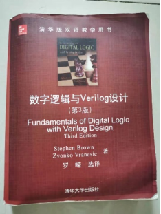
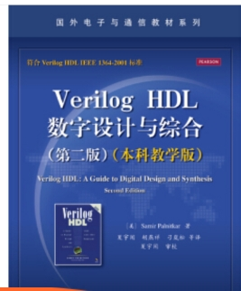
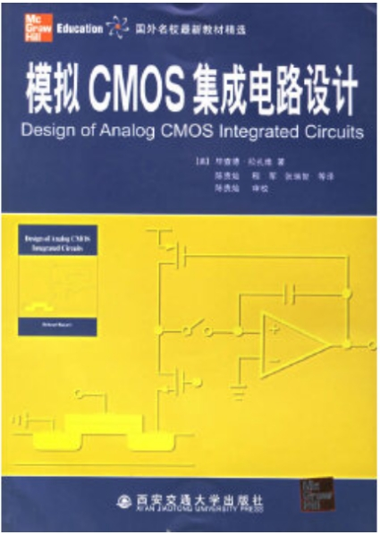

## 1、电类基础MOOC

[半导体物理与器件原理](https://www.icourse163.org/course/FUDAN-1003164004?from=searchPage)

[电路基础](https://www.icourse163.org/course/NWPU-1001599007?from=searchPage)

[信号与系统](https://www.icourse163.org/course/XDU-483006?from=searchPage)

[数字电子技术](https://www.icourse163.org/course/HUST-1001909001?from=searchPage)

[模拟电子技术](https://www.icourse163.org/course/XJTU-1001807015?from=searchPage)

模拟电路基础——从系统级到电路级（有电子书）

 

## 2、数字集成电路设计基础

数字集成电路设计透视 （版本不限，有PPT、电子书）

 

数字逻辑与verilog设计

Verilog HDL 数字设计与综合

## 3、模拟集成电路设计基础 

（注意作者，版本不限）

模拟CMOS集成电路设计（Behzad Razavi）

CMOS模拟集成电路设计（PhillipE.Allen）

模拟集成电路的分析与设计（Paul R.Gray） 

 

 